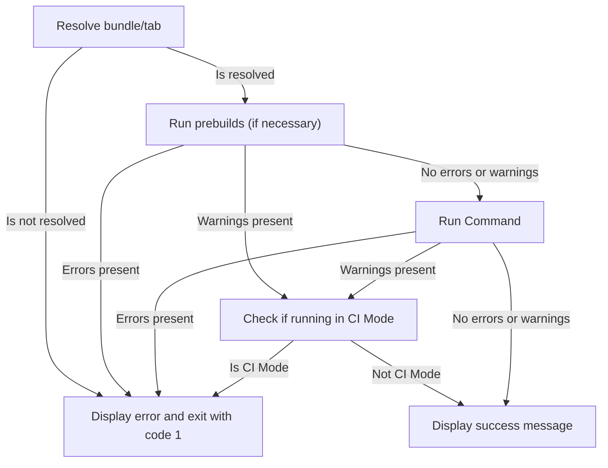

# Command Handlers

Command Line parsing is handled by the [`commander`](https://github.com/tj/commander.js) library.

## Design Philosophy

The command handlers are kept in a separate folder from the builders. This allows us to test the command handlers separately from the builders
by mocking the builder implementations.

Command execution follows the following steps:

1. Command arguments from the user are parsed
1. The arguments are parsed to the corresponding builder
1. The builder returns a result object, which is formatted into a string
1. The formatted result is printed to the terminal
1. `process.exit` is called with a non zero exit code if there were any errors present

## CI Pipeline Compatibility

Since the buildtools need to be run as part of the CI pipeline, it is important that they return non-zero exit codes when appropriate so that
the CI pipeline can detect that errors have occurred and halt the pipeline.

## Command Execution Flow

### Single Bundle/Tab

For a command that processes a single bundle or tab, this is the flow of the command:

