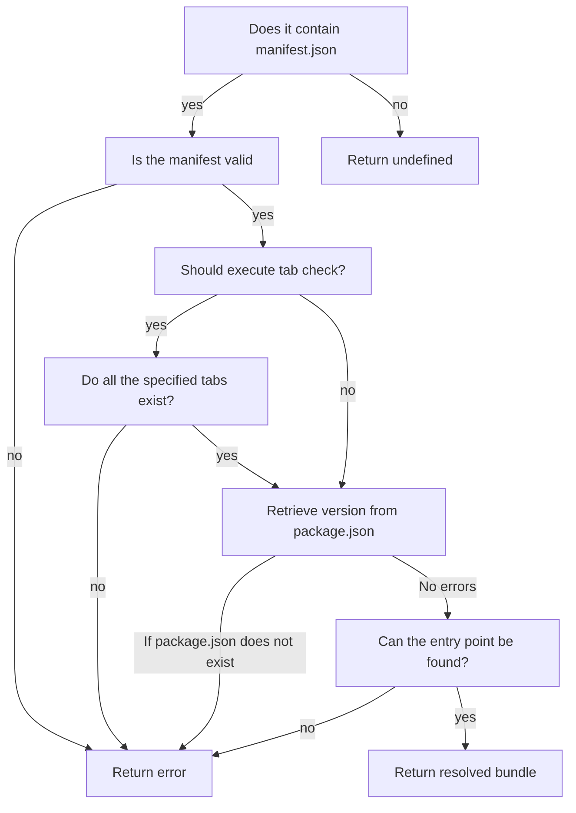
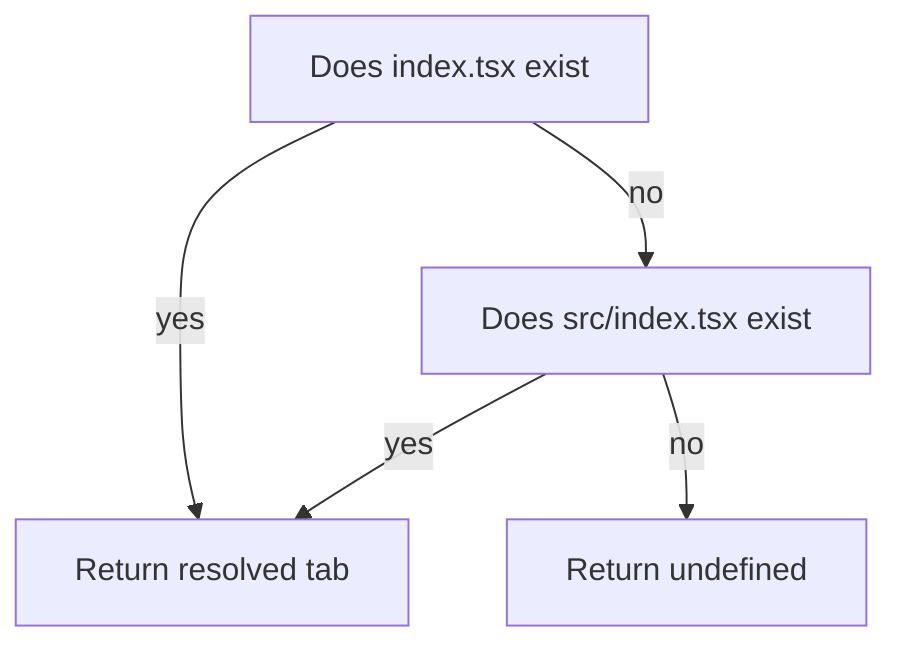

# Bundle and Tab Resolution

This page describes the process of how the buildtools determines what a valid bundle and what a valid tab is.

::: details `modules.json`

If you've been around for a while, you might remember that previously at the root of the module repository there was a file called `modules.json`. This JSON
file contained the list of all bundles and tabs. Effectively, only if a bundle and tab was listed in that file would it be recognized as a valid bundle or tab.

This is no longer the case with the current repository structure. The buildtools determine what bundles and tabs are present so that developers do not need to
configure `modules.json` themselves. So long as your bundle is correctly configured, it will be registered correctly.
:::

## Bundle Resolution

A directory located in the `src/bundles` folder is considered a bundle if it has both a `package.json` and `manifest.json` file.

For each subdirectory located in `src/bundles`, the following process is executed:

Bundle resolution involves loading its manifest, determining its version and name, using the JSON schema to validate the manifest as well as checking the tabs specified in the manifest indeed do exist.

`resolveSingleBundle` executes the resolution process and returns the following type:

<<< ../../../lib/repotools/src/types.ts#ResolvedBundle

### `resolveAllBundles`
`resolveAllBundles` is used to collate the manifests of every single bundle at once. If bundle(s) return an error during resolution, the resolution process will still proceed and the errors are collated together
and returned at the end.

## Tab Resolution
First, the above process is executed to retrieve all manifests from all bundles. From there, we can retrieve the names of every
single tab that is supposed to be present.

For each tab name, it is assumed that a directory of that name exists under `src/tabs`. For each of those directories, the process
below is executed:

This process is also used when checking that the tabs specified the bundle manifest exist.

`resolveSingleTab` used to perform tab resolution returns the following type:

<<< ../../../lib/repotools/src/types.ts#ResolvedTab

Because the entry point for a tab can be either `src/index.tsx` or `index.tsx`, we do need to store the tab's entry point.
