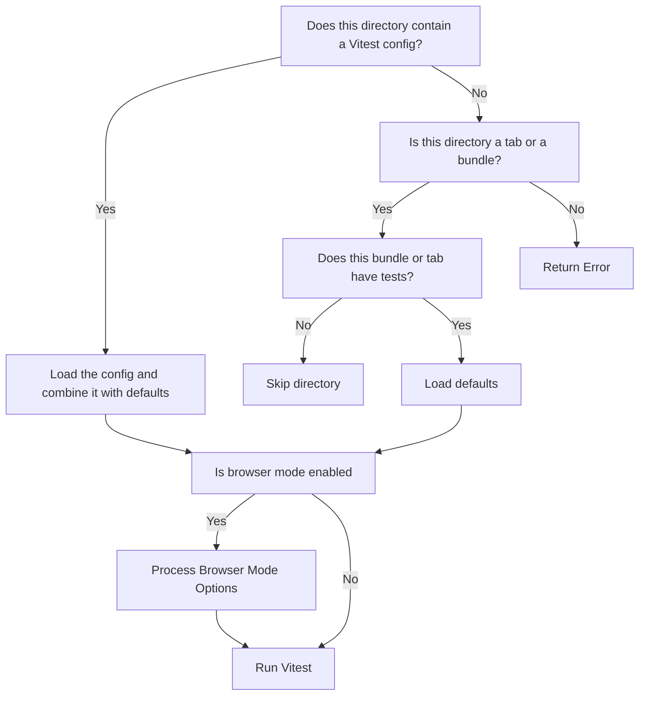

# Testing Using `Vitest`

`vitest` comes with its own [Node API](https://vitest.dev/advanced/api/) that can be used to run tests from Node. To reduce the number of configuration files required,
the buildtools provide their own default `vitest` configuration for bundles and tabs. `vitest` supports a similar concept to workspaces known as [projects](https://vitest.dev/guide/projects.html).

::: details `vitest`'s own configuration utilities
We can combine configurations using the `mergeConfig` helper from `vitest/config`.
This helper doesn't do anything interesting other than directly combine the options between the two parameters.

This means that if we attached the projects configuration to the root config file, the project configuration will end up
getting copied over to every other child configuration.

For example, consider the root config file below with one project configured.

```js
import { defineConfig } from 'vitest/config';
// Root Config
export default defineConfig({
  test: {
    projects: ['./sub-project/vitest.config.js']
  }
})
```
For the child configuration:
```js
import { defineProject, mergeConfig } from 'vitest/config';
import rootConfig from '../vitest.config.js';

export default mergeConfig(
  rootConfig,
  defineProject({
    test: {
      name: 'Child Project'
    }
  })
)
```

The actual configuration that's actually resolved by `vitest` actually looks like this:
```js
const config = {
  test: {
    name: 'Child Project',
    projects: ['./sub-project/vitest.config.js']
  }
}
```
So if you ran `yarn vitest --config ./sub-project/vitest.config.js`, `vitest` would try to locate another `vitest` project
located at `./sub-project/sub-project/vitest.config.js`. Since the child config is intended to be just that, this is simply
incorrect functionality. If that particular configuration file doesn't exist, `vitest` wouldn't even be able to start.

In the spirit of more closely matching the projects configuration system that `jest` uses, a lot of code had to be written
to get around the way `vitest` behaves.
:::

The buildtools maintains a set of default configurations. If no `vitest` configuration is present, then those defaults are used automatically.
Otherwise, that configuration is loaded and its options are combined with the default configurations using `mergeConfig`.

::: details Vite vs Vitest
`vitest` is built on top of `vite`, which is a bundler designed mainly for frontend development. It is used with the devserver for that purpose,
but Vitest makes use of Vite to run tests.

This means that `vite` is the one primarily handling all the transforms necessary (like processing ESM and JSX), and also module resolution. This is why
the `vitest` configs all have their options under a `test` object.
:::

## Config Resolution


### `testall` Command
The `testall` command functions slightly differently. The command first checks the root `vitest.config.js` to identify which directories it should check as a `vitest` project.
For each of those directories, no error will be thrown if the `vitest` config file is missing, unless that directory also contains test files.

Bundles and tabs are allowed to be missing a `vitest` configuration file and still have tests, since the buildtools will automatically provide a default `vitest` configuration.

## Actually Running `vitest` from Node
The main way to run `vitest` from Node is via the [`startVitest`](https://vitest.dev/advanced/api/#startvitest) function. The documentation
for this function is unfortunately a bit lacking, but from what I have figured out, here's how it works:

| |Parameter | Type | Explanation |
| - | --------- | --------- | ----------- |
| 1 | Mode  | <code>'bench' \| 'test'</code> | Vitest Run Mode. Used to distinguish between running tests and benchmarks |
| 2 | Filters | `string[]` | Glob paths to filter test files by |
| 3 | CLI Options | `VitestUserConfig` | Your actual test options. |
| 4 | Vite Options | `ViteUserConfig` | Options for Vite |
| 5 | Vitest Options | `VitestOptions` | A configuration object for `stdout`, `stderr` and the like. | 

That third parameter should be passed a test configuration, rather than the entire Vite config:
```js
const fullViteConfig = {
  test: {
    name: 'Tests'
  }
}

// Pass this to startVitest instead
const vitestConfig = {
  name: 'Tests'
}
```

You should also pass `config: false`. Otherwise, `vitest` will still try to load a `vitest` configuration file
using its own resolution rules:
```js
startVitest('test', [], {
  config: false,
  ...testOptions
})
```
When running tests, you need to actually provide each configuration object as a project:

```js
startVitest('test', [], {
  config: false,
  projects: [yourTestConfig]
})
```

## Browser Mode
If browser mode is enabled, the buildtools will automatically reassign the names of projects and the `include` field will be
moved from the `test` object onto the `browser.instance` object.

Headless mode is always enabled, so long as `vitest` isn't being run in watch mode.
