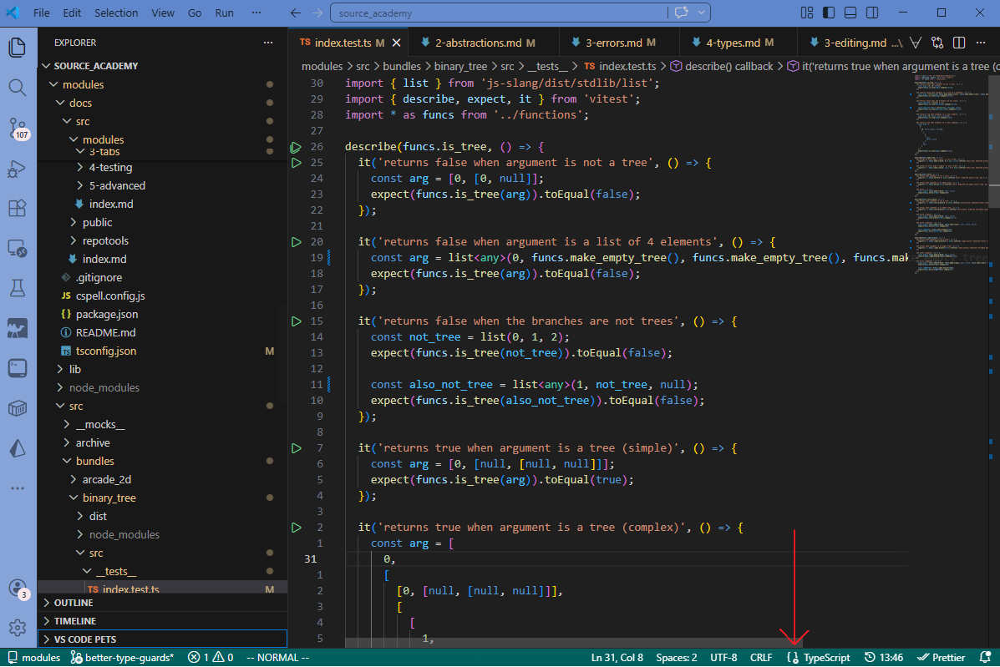
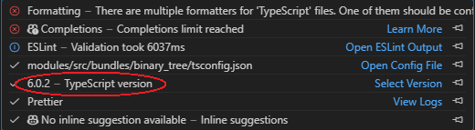

# Working With Typescript

All module source code is written in Typescript, which is a superset of Javascript that supports structural typing. Typescript is entirely a compile-time language, meaning that
it was designed to be transformed into pure Javascript that can then be run in browsers or by Javascript engines like NodeJS.

Bundles and Tabs have separate Typescript configurations, and thus may not always behave the same way.

## Type Errors

If you are using an IDE with Typescript support such as VSCode, Typescript type errors should automatically be displayed to you:

```ts twoslash
// @errors: 2363
const x = 1 - 'a';
```

If for whatever reason you are not using an IDE, or your IDE doesn't have Typescript integration, you can still run the Typescript compiler
from the command line:

```sh
yarn tsc
```

This will output any type errors detected by Typescript to the command line:
```sh
src/test.ts:1:15 - error TS2363: The right-hand side of an arithmetic operation must be of type 'any', 'number', 'bigint' or an enum type.

const x = 1 - 'a';
```

Each type error represents a potential error that might get thrown at runtime (such as trying to divide a string by 10), so
all of these errors should be resolved before your code gets pushed to the repository and published.

### Ignoring Type Errors

Nowadays, many Javascript packages come with Typescript type definitions. If not, there is often a `@types` package that can be installed to provide those type definitions. These type definitions
might vary from version to version, which means depending on the version of the given package installed, you might find that code that didn't previously have type errors might no longer compile
all of a sudden.

This issue may arise especially when Typescript gets updated. Older versions of Typescript behave differently and are sometimes more lenient, while new versions of Typescript often implement new, stricter
type checks. This means that even if your other dependencies don't change, you might still get compile time type errors.

Type errors may also arise when dealing with CommonJS modules in ESM code. CJS default exports occasionally don't translate properly at runtime, but Typescript's import resolution algorithm doesn't recognize it:

```ts twoslash
// js-slang is a CJS package
import createContext from 'js-slang/dist/createContext';

createContext(); // Will throw runtime TypeError: createContext is not a function
// @errors: 2339
createContext.default();
```

#### `@ts-expect-error`

In any of these cases, you can use the `@ts-expect-error` directive to tell Typescript that we are indeed expecting a Typescript error here and not to emit it:

```ts
import createContext from 'js-slang/dist/createContext';

// @ts-expect-error CJS Package's default export is broken
createContext.default();
```

The text following the directive should contain a short explanation on why there is an expected error. 
The `@ts-expect-error` directive should be used as sparingly as possible.

#### `as any`

`@ts-expect-error` suppresses Typescript errors for the entire line. If that line contains multiple Typescript errors, they will all be suppressed, hiding unintentional errors.

For example, since Source is a subset of Javascript, bundle functions, though written in Typescript, still need runtime type checking (more info [here](../../2-bundle/4-conventions/4-types)):

```ts
export function foo(index: number) {
  if (typeof index !== 'number') {
    return 0;
  }

  return index + 1;
}
```

Unit tests must also account for this type checking behaviour. Of course, Typescript won't let you call this function with a string:

```ts twoslash
function foo(index: number) {
  if (typeof index !== 'number') {
    return 0;
  }

  return index + 1;
}

// ---cut---
import { expect, it } from 'vitest';

// @errors: 2345
it('should return 0 when given a string', () => {
  expect(foo('a') / 10).toEqual(0);
});
```

`@ts-expect-error` will of course, suppress the error. What happens if we now change the return type of `foo`, but accidentally forget to change the corresponding tests?

```ts twoslash
// foo.ts
function foo(index: number) {
  if (typeof index !== 'number') {
    // return 0;
    return 'not a number';
  }

  return index + 1;
}

// foo.test.ts
import { expect, it } from 'vitest';

// @errors: 2345 2362
it('should return 0 when given a string', () => {
  expect(foo('a') / 10).toEqual(0);
});
```

Seen above, there are actually two Typescript errors. If we'd used `@ts-expect-error`, **both** of those errors would've been suppressed, when we actually only want to suppress the first one.

In this case, we can use a `as any` assertion instead. Then, the second error still appears:

```ts twoslash
function foo(index: number) {
  if (typeof index !== 'number') {
    // return 0;
    return 'not a number';
  }

  return index + 1;
}

// ---cut---
import { expect, it } from 'vitest';

// @errors: 2362
it('should return 0 when given a string', () => {
  expect(foo('a' as any) / 10).toEqual(0);
});
```

Once again, this should be kept to a minimum. After all, there's no point in running Typescript if we just cast away every single type to `any`.

## Type Assertions

A main design philosophy of Typescript is compatibility with Javscript behaviours. This means that in some cases, Typescript cannot guarantee type-safety. A good example would be with maps:

```ts twoslash
const values = new Map<string, string>([
  ['a', 'a']
]);

if (values.has('a')) {
  const x = values.get('a');
  //    ^?
}
```

The `Map.get` function returns `undefined` when the map doesn't contain the given key. But we just performed the `has` check, so we know that the `values.get` call must return an actual string. Typescript
can't figure this out on its own.

In such cases, the programmer 'knows better' than the Typescript compiler. Typescript provides syntax just for this purpose known as a [type assertion](https://www.typescriptlang.org/docs/handbook/2/everyday-types.html#type-assertions).
For the above case, we can use a non-null assertion:

```ts twoslash
const values = new Map<string, string>([
  ['a', 'a']
]);

if (values.has('a')) {
  // Note the exclamation point
  const x = values.get('a')!;
  //    ^?
}
```

Importantly, this is just a compile time check. If your code is wrong, errors can still be thrown at runtime:

```ts
const values = new Map<string, string>([
  ['a', 'a']
]);

if (values.has('a')) {
  const x = values.get('b')!;

  // x now has type string, but in actual fact x is `undefined` since the
  // map doesn't contain the key 'b'
  // The Typescript compiles, but at runtime an error is thrown

  x.split(''); // TypeError: Cannot read properties of undefined (reading 'split')
}
```

You can also use type assertions for other types:

```ts twoslash
const values: Record<string, string | number> = {
  a: 'a',
  b: 0
};

const x = values.b;
//    ^?

```

Typescript doesn't know that `x` has to be of type `number`, so it won't let us do arithmetic on it (because if `x` were a string you can't divide it by 10):

```ts twoslash
const x: number | string = '0';
// ---cut-before---
// @errors: 2362
const y = x / 10;
```

We can use the `as` keyword to tell Typescript that yes indeed, `x` is a `number`:

```ts twoslash
const values: Record<string, string | number> = {
  a: 'a',
  b: 0
};

const x = values.b as number;
//    ^?


const y = x / 10; // Now compiles with no problem
```

Type assertions should be kept to a minimum to make the best use of the Typescript compiler. This also reduces the chances of a mistake being made and making it through to production
code undetected.

## Mismatched Typescript Versions

If you regularly use different versions of Typescript (for example, because you use workspaces that contain projects with different versions of Typescript), you may find that VSCode highlights
certain Typescript errors that don't appear when running `yarn tsc` or vice versa.

This is probably because Typescript that VSCode is running is different from the version being used by the modules repository. You can check which version of Typescript VSCode is using by hovering
over the button next to the language selector at the bottom right of the VSCode window (or wherever you have it):



This should show a small window where VSCode will show you what version of Typescript its running:



You can use then use the "Select Version" button to change the version it is running. Ultimately, the version that the repository has specified will be the version that is used to verify
your code when you push to the Github repository.
