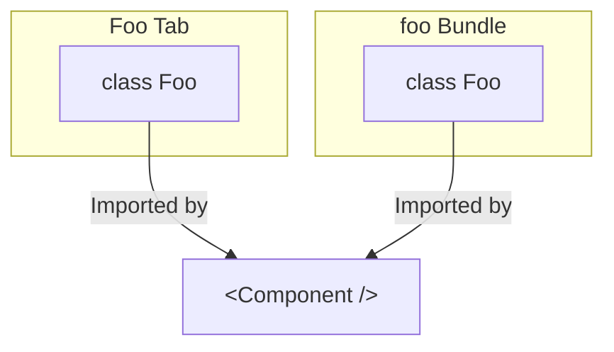

# Troubleshooting

## Installation Troubleshooting

### ESBuild Error

If you encounter errors with esbuild dependencies like the following while building:

```txt
Error: The package "@esbuild/darwin-arm64" could not be found, and is needed by esbuild.
```

You will need to delete the `node_modules` folder and rerun your installation command.

### Yarn/Corepack Installation Issues

Especially if you've worked with other Javascript/Typescript projects before, you might find that `corepack enable` is a command that
does not seem to work (or work permanently) for you.

For example, you might find that `corepack enable` has no effect and the version of Yarn being used is an incorrect version when you run commands.

Things to check for:

- Remove any errant `package.json` or `.yarnrc.yml` files in places like your home directory or elsewhere.
- Run `npm uninstall -g yarn` if you previously installed Yarn globally using installed `npm`.
- For people running Windows, `corepack enable` is a command that needs to be run using administrator privileges.
If this is not possible for you, there are [workarounds](https://github.com/nodejs/corepack?tab=readme-ov-file#corepack-enable--name).

## Runtime Errors

### `instanceof` checks don't work at runtime

Consider the following toy example. The bundle below exports a single `Foo` class.

```ts [foo/src/index.ts]
import context from 'js-slang/context';

export function display_foo() {
  context.moduleContexts.foo.state = new Foo();
}

export class Foo {
  public foo(): string {
    return 'foo!';
  }
}
```

We then have a tab, that imports that class directly from the bundle:

```tsx [Foo/index.tsx]
import { Foo } from '@sourceacademy/bundle-foo';
import { defineTab, type ModuleTab } from '@sourceacademy/modules-lib/tabs/utils';

const Component: ModuleTab = ({ context }) => {
  return <p>This is a tab!</p>;
};

export default defineTab({
  icon: 'save',
  label: 'foo',
  toSpawn: context => context.moduleContexts.foo.state instanceof Foo,
  body: context => <Component context={context} />
});
```

By design, if `display_foo` is called, `foo`'s bundle state gets set to an instance of the `Foo` class, which signals to the frontend that it should spawn
the tab (because `toSpawn` will return `true`).

However, at runtime, you may find that the tab never spawns. A little investigation will show that the `instanceof Foo` check always returns `false`. What's going on?

What has happened is that because the tab imports from the bundle directly, it will keep its own copy of the bundle code, separate from the instance that gets loaded
by `js-slang`:



Currently, there is no easy way to make this work with `instanceof` checks. There are several solutions, one of which
is making use of symbols and type guards:

```ts [foo/src/index.ts]
import context from 'js-slang/context';

export function display_foo() {
  context.moduleContexts.foo.state = new Foo();
}

const fooSymbol = Symbol.for('foo/Foo');

export class Foo {
  public foo(): string {
    return 'foo!';
  }

  private get _symbol() {
    return fooSymbol;
  }

  public static isFoo(obj: unknown): obj is Foo {
    if (typeof obj !== 'object' || obj === null) return false;

    return '_symbol' in obj && obj._symbol === fooSymbol;
  }
}
```

Since `Symbol.for` always returns the same symbol given the same string input, the `isFoo` type check will now work properly:

```tsx [Foo/index.tsx] {11}
import { Foo } from '@sourceacademy/bundle-foo';
import { defineTab, type ModuleTab } from '@sourceacademy/modules-lib/tabs/utils';

const Component: ModuleTab = ({ context }) => {
  return <p>This is a tab!</p>;
};

export default defineTab({
  icon: 'save',
  label: 'foo',
  toSpawn: context => Foo.isFoo(context.moduleContexts.foo.state),
  body: context => <Component context={context} />
});
```

This workaround is necessary for **all** `instanceof` checks when comparing with classes exported by bundles.

> [!TIP] Type Aliases and Interfaces
>
> Typescript type aliases and interfaces get erased at runtime, so you can't use `instanceof` with them. You
> should already have been using other means of verifying those types at runtime.
