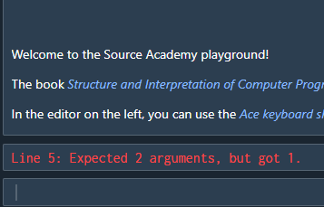

# Developer Type Checking in Source

Though bundles are written in Typescript, Source (except for the Typed Variant) does not support anything beyond rudimentary type checking. This means that it can determine that an expression
like `1 - "string"` is badly typed, but it can't type check more complex programs like the one below, especially when bundle functions are involved:

```ts
import { show } from 'rune';

// Error: show expects a rune!
show(1);
```

::: details Type Maps
Source is moving toward enabling compile-time (or at least pre-execution since Source programs don't really have a "compilation" step) type checking for Source Modules using a feature known as [type maps](../7-type_map).
:::

The above call to `show` **won't** a throw compile-time error. Instead, the error is thrown at runtime by bundle code or even in tab code. This is the case even if the function has been annotated with Typescript types.

In the case of `show`, if no runtime type-checking was performed, no error would be thrown when `show` is called. The error only manifests itself when the Rune tab is displayed:


This is not helpful for the cadet's debugging, as the error occurred in `show`. Thus, by checking if the passed parameter is indeed a `Rune` before
passing it on to other `rune` bundle functions, we make error tracing a lot simpler for cadets.

::: details Use the `unknown` or `any` types?
In Typescript, the `any` and `unknown` types represent an object of an unknown type. More information can be found [here](https://www.typescriptlang.org/docs/handbook/type-compatibility.html#any-unknown-object-void-undefined-null-and-never-assignability). This is where type guards really shine, as they allow the compiler to "narrow" the object's type from being anything down to a specific type. In the case of
`show`, it would work like this:

```ts
export function show(rune: unknown) {
  // Compiler only knows that rune has type unknown
  throwIfNotRune(show.name, rune);

  // Compiler is able to know that rune here has type Rune!
  drawnRunes.push(new NormalRune(rune));
  return rune;
}
```

If we're expecting cadets to be able to pass any type of object in, why not use `unknown` in all these places?

Currently, bundle documentation for cadets relies on these type annotations being present and properly typed. If everything were typed as `unknown`, that's
all cadets would see.

As the typing system is improved, we may be able to use one set of typing for cadets and another for internal implementation.
:::

When throwing errors related to type checking, you should throw an `InvalidParameterTypeError`, which can be imported from the `modules-lib`:

```ts
export function play(value: unknown) {
  if (!is_sound(value)) {
    throw new InvalidParameterTypeError('Sound', value, play.name);
  }

  // ...implementation
}
```

As part of ensuring type safety, there are several conventions bundle code should abide by:

## 1. Cadet facing functions should not have default or rest parameters

The function signature below takes in two booleans, the second of which is optional. This is not supported for Module functions in Source, but is fine if your function
isn't being exposed to cadets.

```ts
// Don't expose this to cadets!
function configure_options(option_1: boolean, option_2: boolean = false) {
  // ...implementation
}

// or this
function concat_strings(...args: string[]) {
  return args.join(',');
}

// But default and rest parameters are okay for internal use
export function exposed_function() {
  configure_options(true);
  concat_strings('str1', 'str2');
}
```

::: details Integration with `js-slang`
Neither default nor rest parameters are currently supported due to an [issue](https://github.com/source-academy/js-slang/issues/1238) on the `js-slang` side.
:::

## 2. Cadet facing functions should not use destructuring for parameters

Javascript allows us to destruct iterables directly within a function's parameters:

```ts
export function foo([x, y]: [string, string]) {
  return x;
}
```

There's nothing inherently wrong with this, but if cadets pass a non-iterable object into the function,
Javascript is going to throw a fairly mysterious error:

```sh
foo(0);

function foo([x, y]) {
            ^
TypeError: number 0 is not iterable (cannot read property Symbol(Symbol.iterator))
```

Javascript also supports object destructuring in parameters:

```ts
interface BarParams {
  x: string;
  y: string;
}

function bar({ x, y }: BarParams) {
  return x;
}
```

However, Javascript doesn't actually throw an error if you pass an invalid object into the function:

```ts
function bar({ x, y }: BarParams) {
  return x;
}

console.log(bar(0)); // prints undefined
```

If an invalid argument gets passed, no error is thrown and the destructured values just take on the value of `undefined` (which you might want to check for).

However, if you use nested destructuring, Javascript _will_ throw an error:

```ts
interface Bar2Params {
  x: {
    a: string;
    b: string;
  };
}

function bar2({ x: { a, b } }: Bar2Params) {
  return a;
}

console.log(bar2(0));
```

The call to `bar2` causes an error like the one below:

```sh
Uncaught TypeError: Cannot read properties of undefined (reading 'a')
  at bar2 (<anonymous>:1:21)
  at <anonymous>:1:1
```

because of course, when `bar2` is called with `0`, `x` becomes `undefined` and trying to destructure `undefined` causes the `TypeError`.

If instead the parameter isn't destructured, it gives you the chance to perform type checking:

```ts
export function foo(arr: [string, string]) {
  if (!Array.isArray(arr)) throw new Error();
  return arr[0];
}

export function bar2(obj: Bar2Params) {
  if (typeof obj !== 'object' || !('x' in obj)) {
    // throw an error....
  }

  return obj.x;
}
```


## 3. If a callback is passed as a parameter, its number of parameters should be validated

By default, Javascript doesn't really mind if you call a function with fewer arguments than it was defined with:

```js
function foo(x, y) {
  return `${x}, ${y}`;
}

foo(); // is fine, x and y are just `undefined`
```

Javascript also doesn't mind if you call a function with more arguments than it was defined with:

```js
function foo(a, b) {
  return a + b;
}

foo(1, 2, 'z'); // is fine, 3 is returned, last parameter is ignored
```

However in Source, both of the above examples will result in evaluation errors like the one below:



This is because Source doesn't allow for a mismatch between the number of arguments expected by a function and the number of arguments provided.

Thus, if your bundle's functions take callback parameters, it is essential that you check that the provided callback accepts the
correct number of parameters. This is done with the `isFunctionOfLength` utility provided by `modules-lib`:

```ts
import { isFunctionOfLength } from '@sourceacademy/modules-lib/utilities';

function draw_connected(pts: number): (c: Curve) => void {
  function renderFunction(c: Curve) {
    if (!isFunctionOfLength(curve, 1)) {
      throw new InvalidCallbackError('Curve', curve, draw_connected.name);
    }

    // ...implementation details
  }

  return renderFunction
}
```

Then, in Source, if the cadet provides an invalid curve (a function that takes only 1 parameter), an error is thrown:

```js
import { draw_connected, make_point } from 'curve';

draw_connected(200)((a, b) => make_point(a, 0)); // error: The provided curve is not a valid Curve function.
```

The `InvalidCallbackError` is a subclass of the `InvalidParameterTypeError`, specifically to be used for the error to be thrown
for invalid callbacks.

The `isFunctionOfLength` function is a type guard that also checks if the given input is a function at all, so it is
not necessary to check for that separately:

```ts
// A summarized implementation
function isFunctionOfLength(f: unknown, l: number): f is Function {
  return typeof f === 'function' && f.length === l;
}
```

### Limitations of `isFunctionOfLength`

Of course, `isFunctionOfLength` can only guarantee that the object passed to it is indeed a function and that it takes
the specified number of parameters. It won't actually guarantee at runtime that the provided parameters are of the defined types. For example:

```ts
export function call_callback(f: (a: string, b: string) => void) {
  if (!isFunctionOfLength(f, 2)) {
    throw new InvalidCallbackError(2, f, call_callback.name);
  }

  return f('a', 'b');
}

// isFunctionOfLength won't be able to guarantee that x and y are strings
call_callback((x, y) => x * y);
```

In fact, if you give it something of type `unknown`, the best it can do is narrow it down to a function that takes parameters of type `unknown`
and returns a value with type `unknown`:

```ts
export function call_callback(f: unknown) {
  if (!isFunctionOfLength(f, 2)) {
    throw new InvalidCallbackError(2, f, call_callback.name);
  }

  // Then f here gets narrowed to (a: unknown, b: unknown) => unknown
  return f('a', 'b');
}
```
