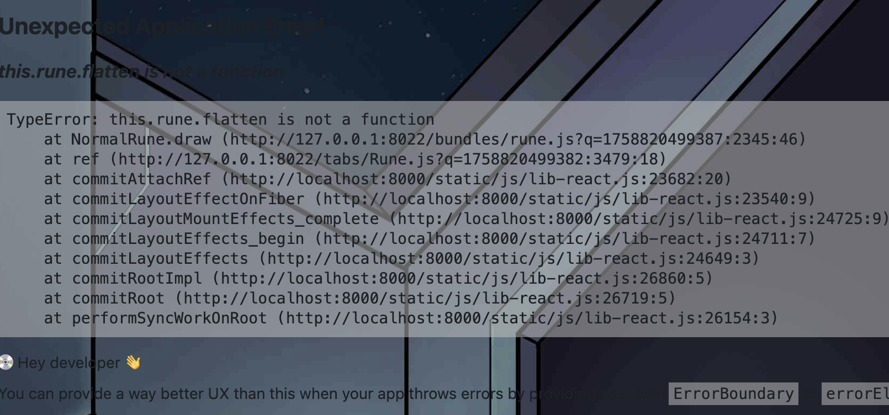
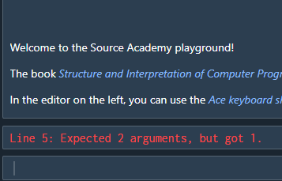

# Developer Type Checking in Source

Though bundles are written in Typescript, Source (except for the Typed Variant) does not support anything beyond rudimentary type checking. This means that it can determine that an expression
like `1 - "string"` is badly typed, but it can't type check more complex programs like the one below, especially when bundle functions are involved:

```ts
import { show } from 'rune';

// Error: show expects a rune!
show(1);
```

::: details Type Maps
Source is moving toward enabling compile-time (or at least pre-execution since Source programs don't really have a "compilation" step) type checking for Source Modules using a feature known as [type maps](../7-type_map).
:::

The above call to `show` **won't** a throw compile-time error. Instead, the error is thrown at runtime by bundle code or even in tab code. This is the case even if the function has been annotated with Typescript types.

In the case of `show`, if no runtime type-checking was performed, no error would be thrown when `show` is called. The error only manifests itself when the Rune tab is displayed:



Since cadets interact with the bundle entirely through its exported functions, checking the runtime types of passed parameters is the main way this kind of type checking needs to be done.
For example, by checking if the passed parameter is indeed a `Rune` before passing it on to other `rune` bundle functions, we make error tracing a lot simpler for cadets.
This lets us highlight that the error occurred with `show`.

::: details Use the `unknown` or `any` types?
In Typescript, the `any` and `unknown` types represent an object of an unknown type. More information can be found [here](https://www.typescriptlang.org/docs/handbook/type-compatibility.html#any-unknown-object-void-undefined-null-and-never-assignability). This is where type guards really shine, as they allow the compiler to "narrow" the object's type from being anything down to a specific type. In the case of
`show`, it would work like this:

```ts
export function show(rune: unknown) {
  // Compiler only knows that rune has type unknown
  throwIfNotRune(show.name, rune);

  // Compiler is able to know that rune here has type Rune!
  drawnRunes.push(new NormalRune(rune));
  return rune;
}
```

If we're expecting cadets to be able to pass any type of object in, why not use `unknown` in all these places?

Currently, bundle documentation for cadets relies on these type annotations being present and properly typed. If everything were typed as `unknown`, that's
all cadets would see.

As the typing system is improved, we may be able to use one set of typing for cadets and another for internal implementation.

In effect, all bundle functions really look like this:

```ts
// Typescript style function overloads
export function show(rune: Rune): Rune;
export function show(rune: unknown) {
  throwIfNotRune(show.name, rune);
  drawnRunes.push(new NormalRune(rune));
  return rune;
}
```
:::

Errors related to type checking the values passed in as parameters should make use of the provided error types to ensure that error messages remain consistent
across bundles. The following sections discuss how to use the validation functions and errors provided by `modules-lib`.

## `InvalidParameterTypeError`

When throwing errors related to type checking, you should throw an `InvalidParameterTypeError`, which can be imported from the `modules-lib`:

```ts
import { InvalidTypeParameterError } from '@sourceacademy/modules-lib/errors';

export function play(value: unknown): asserts value is Sound {
  if (!is_sound(value)) {
    throw new InvalidParameterTypeError('Sound', value, play.name);

    // you can provide the name of the parameter too!
    throw new InvalidParameterTypeError('Sound', value, play.name, 'value');
  }

  // ...implementation
}
```

The parameters of the constructor for `InvalidParameterTypeError` are as follows:
1. String representation of the expected type
2. Actual value passed in by the user
3. _Optional_: The name of the function that the error was thrown from (see [here](./3-errors) for more information)
4. _Optional_: The name of the parameter that is being validated

## Number Related Errors

Numbers in Javascript and Typescript are stored as floats, but most often we want to deal only with integers. Also, we may want to check that a
number is greater than a given minimum, less than a given maximum, or both.

`modules-lib` provides a two functions and a dedicated error type for this purpose:

### `isNumberWithinRange`

The `isNumberWithinRange` function checks that a given value is indeed a `number` and that it falls within the specified parameters. You can use it
to validate that the given number is an integer within a given range:

```ts
function foo(val: unknown) {
  if (!isNumberWithinRange(val, 0, 2)) {
    throw new InvalidNumberParameterError(val, foo.name, { min: 0, max: 2 });
  }
}

foo(1.5); // Error: foo expected integer between 0 and 2, got 1.5.
foo(-1); // Error: foo expected integer between 0 and 2, got -1.
```

You can not specify a maximum, in which case only the lower bound is validated. Similarly, not providing a minimum means that only an upper bound
is validated:

```ts
function isGreaterThan0(val: unknown) {
  if (!isNumberWithinRange(val, 1)) {
    throw new InvalidNumberParameterError(val, isGreaterThan0.name, { min: 1 });
  }
}

isGreaterThan(0); // Error: isGreaterThan0 expected integer greater than 0

function isLessThan10(val: unknown) {
  // 1st parameter is for min, 2nd parameter is max
  if (!isNumberWithinRange(val, undefined, 10)) {
    throw new InvalidNumberParameterError(val, isLessThan10.name, { max: 10 });
  }
}

isLessThan10(100); // Error: isLessThan10 expected integer less than 100
```

Specifying neither a minimum nor a maximum causes the function to act purely as a typecheck:

```ts
function isInteger(val: unknown) {
  if (!isNumberWithinRange(val)) {
    throw new InvalidNumberParameterError(val, isInteger.name, {});
  }
}

isInteger(0.5); // Error: isInteger expects integer
```

The fourth parameter of `isNumberWithinRange` takes a boolean. Setting this to `false` disables the integer check. This is useful if you want to
assert that a given number is a float within a given range:

```ts
function isFraction(val: unknown) {
  if (!isNumberWithinRange(val, 0, 1, false)) {
    throw new InvalidNumberParameterError(val, isFraction.name, { min: 0, max: 1, integer: false });
  }
}

isFraction(2);   // Error: isFraction expects a number between 0 and 1
isFraction(0.5); // no error thrown
```

Specifying the different options as different parameters might be inconvenient. You can use the options object overload instead:

```ts
function isFraction(val: unknown) {
  if (!isNumberWithinRange(val, { min: 0, max: 1, integer: false })) {
    throw new InvalidNumberParameterError(val, isFraction.name, { min: 0, max: 1, integer: false });
  }
}
```

If you don't specify a minimum or a maximum and you disable the integer check, then the function only checks if the provided value has type `number` and is not `NaN`:

```ts
function isNumber(val: unknown) {
  if (!isNumberWithinRange(val, { integer: false })) {
    throw new InvalidNumberParameterEror(val, isNumber.name, { integer: false });
  }
}

isNumber(NaN);        // Error: isNumber expected number.
isNumber('whatever'); // Error: isNumber expected number.
```

### `assertNumberIsWithinRange`

`assertNumberIsWithinRange` is the assertion version of `isNumberWithinRange`. You can use this function instead of doing the boolean check:

```ts
function foo(val: unknown) {
  if (!isNumberWithinRange(val, 0, 1)) {
    throw new InvalidNumberParameterError(val, { max: 1, min: 0, func_name: foo.name });
  }
}

// can be written as
function foo(val: unknown) {
  assertNumberWithinRange(val, { max: 1, min: 0, func_name: foo.name });
}
```

### `InvalidNumberParameterError`

This is a subclass of the `InvalidParameterTypeError` that is thrown when a parameter is expecting a number, but the provided value is either not a number
or doesn't fall within the expected range.

Here are the parameters of the constructor:
1. The actual value that was validated
2. Either a `string` or an `InvalidNumberParameterErrorOptions` object.
  - If a string is provided, then that is taken as the name of the expected type
  - Otherwise, the options object controls what error message is shown to the user (i.e whether an integer or a number was expected, or if it was outside of the desired range)
3. Name of the function that the validation was performed for.
4. `param_name` _Optional_: Name of the parameter that the validation was performed for.

## Type Safety Conventions for functions

As part of ensuring type safety, there are several function related conventions bundle code should abide by:

### 1. Cadet facing functions should not have default, optional or rest parameters

The functions make use of default, optional and rest parameters. This is not supported for Module functions in Source, but is fine if your function
isn't being exposed to cadets.

```ts
// Don't expose this to cadets!
function configure_options(option_1: boolean, option_2: boolean = false) {
  // ...implementation
}

// or this
function concat_strings(...args: string[]) {
  return args.join(',');
}

// or this
function configure_other_option(other_option?: boolean) {
  // ...implementation
}

// But default and rest parameters are okay for internal use
export function exposed_function() {
  configure_options(true);
  concat_strings('str1', 'str2');
}
```

::: details Integration with `js-slang`
Neither default nor rest parameters are currently supported due to an [issue](https://github.com/source-academy/js-slang/issues/1238) on the `js-slang` side.
:::

Instead, if you require such functionality, they should be defined as separate functions:

```ts
// Equivalent implementation of configure_options from the above example

export function configure_options_1_and_2(option_1: boolean, option_2: boolean) {}

export function configure_option_1_only(option_1: boolean) {
  configure_options_1_and_2(option_1, false);
}
```

### 2. Cadet facing functions should not use destructuring for parameters

Javascript allows us to destruct iterables directly within a function's parameters:

```ts
export function foo([x, y]: [string, string]) {
  return x;
}
```

There's nothing inherently wrong with this, but if cadets pass a non-iterable object into the function,
Javascript is going to throw a fairly mysterious error:

```sh
foo(0);

function foo([x, y]) {
            ^
TypeError: number 0 is not iterable (cannot read property Symbol(Symbol.iterator))
```

Javascript also supports object destructuring in parameters:

```ts
interface BarParams {
  x: string;
  y: string;
}

function bar({ x, y }: BarParams) {
  return x;
}
```

In this case, Javascript doesn't actually throw an error if you pass an invalid object into the function:

```ts
function bar({ x, y }: BarParams) {
  return x;
}

console.log(bar(0)); // prints undefined
```

If an invalid argument gets passed, no error is thrown and the destructured values just take on the value of `undefined` (which you might want to check for).

However, if you use nested destructuring, Javascript _will_ throw an error:

```ts
interface Bar2Params {
  x: {
    a: string;
    b: string;
  };
}

function bar2({ x: { a, b } }: Bar2Params) {
  return a;
}

console.log(bar2(0));
```

The call to `bar2` causes an error like the one below:

```sh
Uncaught TypeError: Cannot read properties of undefined (reading 'a')
  at bar2 (<anonymous>:1:21)
  at <anonymous>:1:1
```

because of course, when `bar2` is called with `0`, `x` becomes `undefined` and trying to destructure `undefined` causes the `TypeError`.

In both cases, if instead the parameter isn't destructured, you have the chance to perform type checking:

```ts
export function foo(arr: [string, string]) {
  if (!Array.isArray(arr) && arr.length !== 2) {
    throw new InvalidParameterTypeError('Tuple of length 2', arr, foo.name, 'arr');
  }
  return arr[0];
}

export function bar2(obj: Bar2Params) {
  if (typeof obj !== 'object' || !('x' in obj)) {
    // throw an error....
  }

  return obj.x;
}
```

### 3. If a callback is passed as a parameter, its number of parameters should be validated

By default, Javascript doesn't really mind if you call a function with fewer arguments than it was defined with:

```js
function foo(x, y) {
  return `${x}, ${y}`;
}

foo(); // is fine, x and y are just `undefined`
```

Javascript also doesn't mind if you call a function with more arguments than it was defined with:

```js
function foo(a, b) {
  return a + b;
}

foo(1, 2, 'z'); // is fine, 3 is returned, last parameter is ignored
```

However in Source, both of the above examples will result in evaluation errors like the one below:



This is because Source doesn't allow for a mismatch between the number of arguments expected by a function and the number of arguments provided.

Thus, if your bundle's functions take callback parameters, it is essential that you check that the provided callback accepts the
correct number of parameters. This is done with the `isFunctionOfLength` utility provided by `modules-lib`:

```ts
import { isFunctionOfLength } from '@sourceacademy/modules-lib/utilities';

function draw_connected(pts: number): (c: Curve) => void {
  function renderFunction(c: Curve) {
    if (!isFunctionOfLength(curve, 1)) {
      throw new InvalidCallbackError('Curve', curve, draw_connected.name);
    }

    // ...implementation details
  }

  return renderFunction;
}
```

Then, in Source, if the cadet provides an invalid curve (a function that takes only 1 parameter), an error is thrown:

```js
import { draw_connected, make_point } from 'curve';

draw_connected(200)((a, b) => make_point(a, 0)); // error: The provided curve is not a valid Curve function.
```

> [!INFO] `InvalidCallbackError`
>
> The `InvalidCallbackError` is a subclass of the `InvalidParameterTypeError`, specifically to be used for the error to be thrown
> for invalid callbacks. The parameters for its constructor are as follows:
> 
> 1. Number of Parameters/String representation of expected function:
>   - If a number is given, it is assumed that a function with that number of parameters is expected
>   - If a string is given, that will be used as a name for the function type.
> 2. The actual value passed in by the user
> 3. _Optional_: The name of the function that the error was thrown from (see [here](./3-errors) for more information)
> 4. _Optional_: The name of the parameter that is being validated

The `isFunctionOfLength` function is a type guard that also checks if the given input is a function at all, so it is
not necessary to check for that separately:

```ts
// A summarized implementation
function isFunctionOfLength(f: unknown, l: number): f is Function {
  return typeof f === 'function' && f.length === l;
}
```

> [!WARN] Limitations of `isFunctionOfLength`
> 
> Of course, `isFunctionOfLength` can only guarantee that the object passed to it is indeed a function and that it takes
> the specified number of parameters. It won't actually guarantee at runtime that the provided parameters are of the defined types. For example:
> 
> ```ts
> export function call_callback(f: (a: string, b: string) => void) {
>   if (!isFunctionOfLength(f, 2)) {
>     throw new InvalidCallbackError(2, f, call_callback.name);
>   }
> 
>   return f('a', 'b');
> }
>
> // isFunctionOfLength won't be able to guarantee that x and y are strings
> call_callback((x, y) => x * y);
> ```
> 
> In fact, if you give it something of type `unknown`, the best it can do is narrow it down to a function that takes parameters of type `unknown`
> and returns a value with type `unknown`:
> 
> ```ts
> export function call_callback(f: unknown) {
>   if (!isFunctionOfLength(f, 2)) {
>     throw new InvalidCallbackError(2, f, call_callback.name);
>   }
> 
>   // Then f here gets narrowed to (a: unknown, b: unknown) => unknown
>   return f('a', 'b');
> }
> ```

There is an assertion version of the function available: `assertFunctionOfLength`:

```ts
import { assertFunctionOfLength } from '@sourceacademy/modules-lib/utilities';

type Curve = (t: number) => number;

function foo(callback: Curve) {
  assertFunctionOfLength(callback, 1, foo.name, 'Curve', 'callback');
}
```
