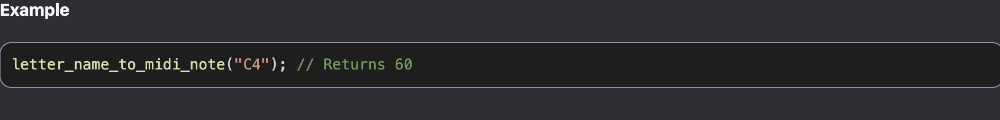
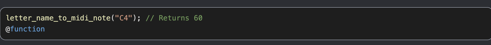
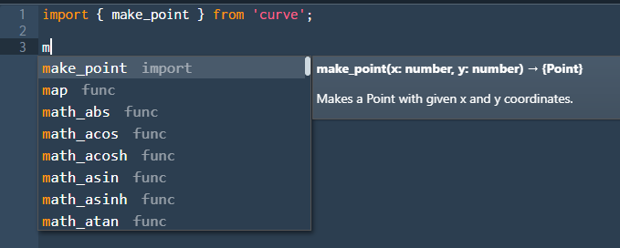

# Bundle Documentation for Cadets

For cadets to know how to use your bundle's functionalities, you must provide documentation. Cadet documentation for Source bundles is generated using the [`typedoc`](https://typedoc.org) tool. There are two types: HTML and JSON documentation.

By reading comments and type annotations, `typedoc` is able to generate both human readable documentation and documentation in the form of JSON.

> [!WARNING]
> `typedoc` normally performs type checking for code before generating its outputs. This functionality has been turned off for this repository as more often then not, `tsc` will be run before `typedoc`, making the type checking performed by `typedoc` extraneous.
>
> This does mean that if the documentation is built without running `tsc`, there is a possibility that type errors will cause `typedoc` to crash.

## Writing Documentation

`typedoc` reads both Typescript type annotations, as well as [TSDOC](https://tsdoc.org) style comments. It will build documentation for all functions and constants exported by the particular bundle's entry point.
For example, since the `curve` bundle exports the `make_point` function, `typedoc` will generate documentation for it. However, there are many other functions that the bundle does not expose that won't have documentation generated.

Documentation should be written in [Markdown](https://www.markdownguide.org/getting-started/). That way, both IntelliSense and Typedoc will be able to process it. During documentation generation,
the markdown is converted to raw HTML.

::: details Type Aware annotations
[JSDoc](https://jsdoc.app) (and TSDoc) both support annotations that express type information directly like `@type` or annotations that can optionally contain type information like `@param` and `@returns`.
Since modules are already written in Typescript, there is no need to use type-aware annotations to document the type of an object.

All type annotations should be written in directly Typescript
so as not to confuse Typedoc and ensure that the Typescript compiler is able to ensure type safety.

If you do need to the type of an export to be documented differently from its type in Typescript source code, you can use a [type map](../../7-type_map).
:::

Let us look at more examples from the `curve` module.

### Functions

```ts
// functions.ts
/**
 * Makes a Point with given x and y coordinates.
 *
 * @param x x-coordinate of new point
 * @param y y-coordinate of new point
 * @returns with x and y as coordinates
 * @example
 * ```
 * const point = make_point(0.5, 0.5);
 * ```
 */
export function make_point(x: number, y: number): Point {
  return new Point(x, y, 0, [0, 0, 0, 1]);
}
```

Notice that in the example above, each `@param` tag is followed directly by the name of the parameter its describing, which is then followed
by the description of the parameter itself.

Missing the documentation for a parameter is okay (not that you should), but trying to document a parameter that doesn't exist will cause a linting
error:

```ts
/**
 * Oops p1 isn't documented!
 * @param p3 This parameter doesn't exist and so this will cause a lint error!
 */
export function foo(p1: string, p2: string) {
  // ...implementation
}
```

### Use of `@function`

Following v0.28, Typedoc only documents function-like types as functions if they are explicitly typed as functions (see the issue [here](https://github.com/TypeStrong/typedoc/issues/2881)).
This means that if you have code that looks like this:

```ts
// curve/functions.ts
function createDrawFunction(
  scaleMode: ScaleMode,
  drawMode: DrawMode,
  space: CurveSpace,
  isFullView: boolean
): (numPoints: number) => RenderFunction {
  return (numPoints: number) => {
    // implementation details
  };
}

export const draw_connected = createDrawFunction('none', 'lines', '2D', false);
```

and `RenderFunction` has the following type:

```ts
// curve/types.ts
/**
 * A function that specifies additional rendering information when taking in
 * a CurveFunction and returns a ShapeDrawn based on its specifications.
 */
export type RenderFunction = {
  (func: Curve): CurveDrawn;
  is3D: boolean;
};
```

Typedoc won't consider `draw_connected` to be a function. Instead it will consider it to be a variable:


This is because `drawConnected` is of type `RenderFunction` and `RenderFunction` is only _function-like_.

To remedy this, you can either change the type to be an actual function type, or include the `@function` tag in your documentation:

```ts {6}
/**
 * Returns a function that turns a given Curve into a Drawing, by sampling the
 * Curve at `num` sample points and connecting each pair with a line.
 * The parts between (0,0) and (1,1) of the resulting Drawing are shown in the window.
 *
 * @function
 * @param num determines the number of points, lower than 65535, to be sampled.
 * Including 0 and 1, there are `num + 1` evenly spaced sample points
 * @return function of type Curve → Drawing
 * @example
 * ```
 * draw_connected(100)(t => make_point(t, t));
 * ```
 */
export const draw_connected = createDrawFunction('none', 'lines', '2D', false);
```

The export will now be correctly recognized as a function:


The buildtools are configured to emit a warning if a variable is detected to have function signatures but cannot automatically rectify
this problem.

### Variables/Constants

Constants can be documented in a similar fashion:

```ts
/**
 * Represents the mathematical constant PI
 */
const PI: number = 3.14159;
```

Also similar to function return types and parameters, because the types of variables is determined by the Typescript compiler, it is unnecessary
to use the `@type` tag here.

### Entry Point

At the entry point for each bundle, there should be a block comment that provides general information about the bundle.

This example is taken from the `repeat` bundle:

```ts
// repeat/src/index.ts
/**
 * Test bundle for Source Academy modules repository
 * @author Loh Xian Ze, Bryan
 * @author Tang Xin Kye, Marcus
 * @module repeat
 */

export { repeat, twice, thrice } from './functions';
```

It is important that you provide an `@module` tag in this description. Otherwise, the build tools may not be able to detect your bundle's
documentation properly.

> [!TIP]
> An ESLint Rule has been configured specifically for this purpose, so a lint error should appear if you forget to do so.

### Use of `@hidden`

If there are exports you want hidden from the output of the documentation, you must use the `@hidden` tag.

The example below is taken from the `rune` bundle:

```ts
// rune/src/type_map.ts
import createTypeMap from '@sourceacademy/modules-lib/type_map';

const typeMapCreator = createTypeMap();

export const { functionDeclaration, variableDeclaration, classDeclaration } = typeMapCreator;

/** @hidden */
export const type_map = typeMapCreator.type_map;
```

This causes `type_map` to be removed from the documentation, even if it is exported from `rune/src/index.ts`.

> [!WARNING]
> Bundle `type_map`s are supposed to be internal implementation details hidden from users. If you forget to apply a `@hidden` tag to
> your bundle's type map export, the build tools will show a warning.

### Use of `@example`

`@example` blocks allow the developer to provide code snippets that serve as examples for for how the function/variable is intended to be
used. Consider an example from the `midi` bundle below:

```ts {10-13}
/**
 * Converts a letter name to its corresponding MIDI note.
 * The letter name is represented in standard pitch notation.
 * Examples are "A5", "Db3", "C#7".
 * Refer to <a href="https://i.imgur.com/qGQgmYr.png">this</a> mapping from
 * letter name to midi notes.
 *
 * @param note given letter name
 * @return the corresponding midi note
 * @example
 * ```
 * letter_name_to_midi_note("C4"); // Returns 60
 * ```
 * @function
 */
export function letter_name_to_midi_note(note: NoteWithOctave): MIDINote {}
```

When the documentation is renderered, a code block is produced:



Note that your code examples should be surrounded in a Markdown code block (using the triple backticks ```` ``` ````). This will
help Typedoc figure out what content belongs to your code block. The language specifier is not required here as it is assumed that
your code examples are written in Typescript.

::: details Why you should use a code block

If you use an inline code example, Typedoc might include things in your example that you didn't mean to include. Consider
a modified version of the example above:

```ts {10}
/**
 * Converts a letter name to its corresponding MIDI note.
 * The letter name is represented in standard pitch notation.
 * Examples are "A5", "Db3", "C#7".
 * Refer to <a href="https://i.imgur.com/qGQgmYr.png">this</a> mapping from
 * letter name to midi notes.
 *
 * @param note given letter name
 * @return the corresponding midi note
 * @example letter_name_to_midi_note("C4"); // Returns 60
 * @function
 */
export function letter_name_to_midi_note(note: NoteWithOctave): MIDINote {}
```

Typedoc ends up including the `@function` tag as part of the code block:



Using a code block makes it clear exactly what is intended to be part of your example code block.
:::

During documentation generation, the code in your code block will be parsed by a Typescript parser to ensure that you have written
valid Typescript code. It will print a warning message if your example code doesn't produce syntactically valid Typescript.

### Other Tags

There are a variety of tags that Typedoc supports. This list can be found [here](https://typedoc.org/documents/Tags.html). When writing your documentation you should use these tags
to the best of your ability to help make your documentation as comprehensive as possible.

## HTML Documentation

The human readable documentation resides in the `build/documentation` folder. You can view its output [here](https://source-academy.github.io/modules/documentation). This is what the output for `make_point` looks like:


The description block supports formatting using Markdown. The markdown is translated into HTML during building.

## JSON Documentation

To provide the frontend with documentation that can be directly displayed to the user, each module has its own json file in the `jsons` folder containing the formatted descriptions of exported variables.
Using the example code above, here is what the JSON documentation looks like for the actual `curve` bundle:

```jsonc
{
  "make_point": {
    "kind": "function",
    "name": "make_point",
    "description": "<p>Makes a Point with given x and y coordinates.</p>",
    "params": [
      [
        "x",
        "number"
      ],
      [
        "y",
        "number"
      ]
    ],
    "retType": "Point"
  },
  // ...other functions and constants
}
```

This is then displayed by the frontend:



When building the json documentation for a bundle, the following steps are taken:

1. From `typedoc`'s output, extract the [project](https://typedoc.org/api/classes/ProjectReflection.html) corresponding to the bundle.
1. For each exported variable, run it through a converter to convert the `typedoc` project into a single string:
    - For constants, their names and types are extracted
    - For functions, their name, the names and types of each parameter, and return types are extracted.\
    The descriptions of both functions are constants are also included, but first they are passed through a Markdown to HTML converter called [drawdown](https://github.com/adamvleggett/drawdown), included in this project as `drawdown.ts`
3. The code then converts it to the HTML format expected by the frontend
3. All the processed strings then get written to a json file in the `jsons` folder.

If no documentation could be found, or there was an error parsing the documented code, the system will still output JSONs, just with warnings.

## Code Samples

You can include "sample" files that are written in Javascript. These files can be used as part of documentation but are not intended to be included during compilation or
used by Source users. Refer to the `csg` bundle for an example of this. Usually, these are contained in a `samples` folder located within the bundle directory.

These files aren't automatically included by Typedoc, but Typedoc does have [a mechanism](https://typedoc.org/documents/External_Documents.html) for including external code. Alternatively, a simple solution
would be to provide a link to the Github folder in which your sample files are contained.

## Other Typedoc Options

`typedoc` options can be specified in the `"typedocOptions"` section of your `tsconfig.json`. Unfortunately, we cannot support dynamic configurations (like those loaded using a Javascript file)
at the moment.
