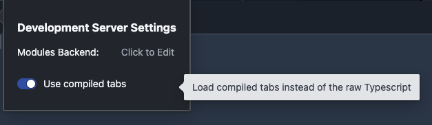

# Using the Development Server

Normally, tabs need to be displayed using the frontend. If you wish to test your tabs using a copy of the frontend, follow the instructions [here](../7-frontend).

The Development Server (or dev server, for short) is a lightweight version of the frontend that provides developers with a copy of the Source Academy playground so
that they can run their bundle code and see the actual graphic interface of their tabs.

## Running the Dev Server

To run the dev server, simply use:

```sh
yarn devserver
```

> [!NOTE]
> Because the dev server relies on Vite which needs to pre-bundle its dependencies, you will need to have compiled your tab
> using the steps listed [here](../5-compiling) before starting the dev server.

You will also need to start the modules server using `yarn serve`.

The dev server can then be viewed from the web browser.

## Compiled Mode

By default, the dev server is in hot reload mode. This means the dev server can detect changes to tabs as they are being made
and automatically reload the displayed tab without requiring a refresh of the page or for the user to rerun code.

In this mode, the dev server can only detect the changes you've made **after** you've compiled your tab.

However, should you wish to test the compiled version of your tab, you can switch the dev server to compiled mode by following the steps below:

1. Click on the settings button:


2. Switch to compiled mode

