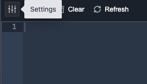
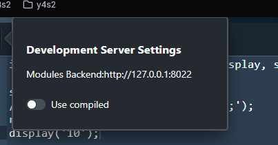

# Using the Development Server

The Development Server (or devserver, for short) is a lightweight version of the frontend that provides developers with a copy of the Source Academy playground so
that they can run their bundle code and see the actual graphic interface of their tabs.

There are many features absent from the devserver (such as assessments). If you need to test your bundles and tabs with those features, you will
need to test with the frontend instead.

## Running the Dev Server

If you used a focused install, you may have to run this command first:

```sh
yarn workspaces focus @sourceacademy/modules-devserver
```

Then to start the devserver, simply run the following command from the **root** of the repository:

```sh
yarn devserver
```

> [!NOTE] Pre-Compiling Tabs
> Because the dev server relies on Vite which needs to pre-bundle its dependencies, you will need to have compiled any tabs you're
> intending to test using the steps listed [here](../../3-tabs/5-compiling.md) before starting the dev server.

You will also need to start the modules server using `yarn buildtools serve`. The caveats from [that section](../1-desktop#the-modules-server) still apply.

The dev server can then be viewed from the web browser.

## Hot-Reload Mode

By default, the dev server is in hot reload mode. This means the dev server can detect changes to tabs and bundles (and their dependencies) as they are being made
and automatically reload the displayed tab without requiring a refresh of the page or for the user to rerun code.

## Compiled Mode

In this mode, the dev server can only detect the changes you've made **after** you've compiled your tab or bundle.
Should you wish to test the compiled versions instead of the raw Typescript source, you can switch the dev server
to compiled mode by following the steps below:

1. Click on the settings button:


2. Switch to compiled mode


If need be, you can use the the textbox to customize which server to load modules from.
