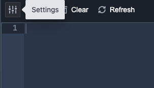
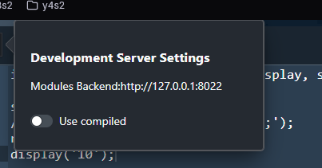

# Using the Development Server

The Development Server (or devserver, for short) is a lightweight version of the frontend that provides developers with a copy of the Source Academy playground so
that they can run their bundle code and see the actual graphic interface of their tabs.

There are many features absent from the devserver (such as assessments). If you need to test your bundles and tabs with those features, you will
need to test with the frontend instead.

> [!IMPORTANT] Developing with bundles
>
> When changes are made to tabs, the resulting changes in the UI can be visualized immediately since Vite is constantly refreshing the displayed UI.
> However, bundles are only evaluated once per Source evaluation, which means that changes to bundles cannot be automatically reflected.
>
> A possible development workflow would look like this:
> 1. Run code and spawn the tab
> 2. Make changes to the bundle code
> 3. Re-run code for changes to be reflected
>
> You don't have to rebuild or recompile your bundle after making changes.

The REPL provided by the devserver will display output as seen by cadets. Detailed error information can be found
in the browser console (as well as any `console.log` calls made by your code).

## Running the Dev Server

If you used a focused install, you may have to run this command first:

```sh
yarn workspaces focus @sourceacademy/modules-devserver
```

Then to start the devserver, simply run the following command from the **root** of the repository:

```sh
yarn devserver
```

> [!NOTE] Pre-Compilation
>
> Because the dev server relies on Vite which needs to pre-bundle its dependencies, you will need to have compiled any tabs you're
> intending to test using the steps listed [here](../../3-tabs/4-compiling) before starting the dev server.
>
> You should also ensure that modules manifest has been built.

The dev server can then be viewed from the web browser.

## Hot-Reload Mode

By default, the dev server is in hot reload mode. This means the dev server can detect changes to tabs and bundles (and their dependencies) as they are being made
and automatically reload the displayed tab without requiring a refresh of the page or for the user to rerun code.

## Compiled Mode

In this mode, the dev server can only detect the changes you've made **after** you've compiled your tab or bundle.
Should you wish to test the compiled versions instead of the raw Typescript source, you can switch the dev server
to compiled mode by following the steps below:

1. Click on the settings button:


2. Switch to compiled mode


> [!WARNING]
>
> When switching between modes, you will need to re-run code for the different version of the tab/bundle to be loaded.

If need be, you can use the the textbox to customize which server to load modules from. You may have to rerun your code
after switching this setting for the server to load the asset you've selected.

You will also need to start the modules server using `yarn buildtools serve`. The caveats from [that section](../1-desktop#the-modules-server) still apply.

> [!IMPORTANT] Working with Bundles
>
> In compiled mode, transitive changes won't be automatically detected by Vite, so you will have to rebuild/recompile the bundle manually
> after each change you make.
>
> Tabs depend on bundles in 1 of 2 ways:
> - Javascript dependency (i.e if you import from `@sourceacademy/bundle-curve`)
>   - You will need to recompile after every change (`yarn compile`)
> - Source dependency (i.e. if the bundle was imported and evaluated through `js-slang`)
>   - You will need to rebuild after every change (`yarn build`)
>
> Following which, you will have to rerun your code to see the changes in effect.
