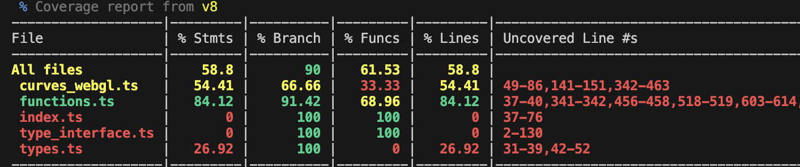
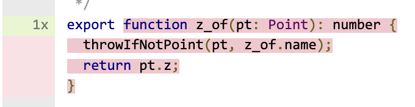

# Testing Overview

The testing library used by this repository is [`vitest`](https://vitest.dev).

> [!IMPORTANT]
> Other Source Academy repositories may use `jest` as their testing package. Although `vitest` has been designed as a drop in replacement for `jest`,
> there are subtle differences between the two. For example, `vi.spyOn` doesn't replace the implementation within the module while `jest.spyOn` does (See [here](https://vitest.dev/guide/mocking.html#mocking-pitfalls)).
>
> Refer to [this page](https://vitest.dev/guide/migration.html#jest) for more differences between `jest` and `vitest`.

## Running Tests

To run tests for a given bundle or tab, simply run either of the following commands within the directory:

```sh
yarn buildtools test --project .
yarn test # If your package.json has this script specified
```

By default, `vitest` will quit after running tests. If you wish to run the tests in watch mode, use the `--watch` parameter.

You can also use `--update` to update snapshots and `--coverage` to run the V8 coverage reporter.

For bundles and tabs, the test environment should always be `jsdom`, since they are intended for the browser.

## Coverage

Test coverage broadly refers to the how much of your code's functionality is covered by your unit tests as a way of identifying
things that might need to be tested.

You can generate a coverage report for your tests by running `yarn test --coverage`. There are several metrics by which code
coverage is measured when using `vitest`, namely statements, branches, lines and functions.

> [!WARNING]
> Coverage reports might not be generated if your any of your tests fail.

The coverage report is printed out to the terminal:


and can also be viewed as a HTML report using your browser:


The browser report is also able to show you exactly what parts of your code remain uncovered by testing:


Right now, there isn't a coverage threshold in place (i.e your tests won't be considered passed if your overall coverage is too low),
but there may be one in the future, and anyways high code coverage is good practice.

### Ignoring Files for Coverage

There might be functionality that's completely impossible to test. For example, if we tried to mock the `vitest` utilities,
the `vitest` instance running our tests would break:

```ts
// This test won't be able to execute!
import { foo } from '../functions';
import * as vitest from 'vitest';

vitest.vi.spyOn(vitest, 'test');

vitest.describe('A test suite', () => {
  vitest.test('Expect test to be called', () => {
    foo();
    vitest.expect(vitest.test).toHaveBeenCalledOnce();
  });
});
```

In such a case you can use an `ignore` directive to instruct `vitest` to ignore the given lines or files when determining coverage:

```ts
/* v8 ignore start */
export function foo() {
  // This function won't be considered for code coverage.
}
/* v8 ignore stop */
```

More information can be found [here](https://github.com/istanbuljs/v8-to-istanbul#ignoring-uncovered-lines)

## Custom Test Configuration

You don't need to create a custom `vitest.config.js` for your bundle or tab. If the configuration file is absent, the default testing configuration
options will be applied.

::: details `vitest.config.js` vs `vitest.config.ts`
`vitest` actually supports having its config files being written in Typescript. The repository's `vitest` config files however
are sometimes not attached to any Typescript project. This confuses other tooling in the repository (like ESLint), so the files are
written in plain Javascript with a <nobr><code>// @ts-check</code></nobr> directive.
:::

> [!WARNING] Dependency Optimization Error
> You may find that when your tests run on your local machine the following warning (or something similar) may appear:
>
> ```sh
> [vite] (client) ✨ new dependencies optimized: react/jsx-dev-runtime  
> [vite] (client) ✨ optimized dependencies changed. reloading  
> [vitest] Vite unexpectedly reloaded a test. This may cause tests to fail, lead to flaky behaviour or duplicated test runs.  
> For a stable experience, please add mentioned dependencies to your config's `optimizeDeps.include` field manually.  
> ```
>
> If this warning appears when you run your tests on the machine, you may find that your tests may still pass on the local machine, but
> fail on the CI pipeline.
>
> This is because you have a dependency that Vite can only detect at runtime and so has to run its internal transforms twice. This causes
> Vitest to fail, since the original import would have failed. To fix this, you should create your own `vitest.config.js` and add those
> dependencies to `optimizeDeps`:
>
> ```js
> export default defineProject({
>   optimizeDeps: {
>     include: ['react/jsx-dev-runtime']
>   },
>   test: {
>     name: 'Root Project'
>   }
> });
> ```
>
> For more information, refer to the [Vite](https://vite.dev/config/dep-optimization-options.html#optimizedeps-include) documentation.

Should you need to use a unique configuration, simply create your own `vitest.config.js` at the root of your bundle/tab.
The configuration options in your `vitest.config.js` will be used **in addition** to the default options, so it is not necessary
to redefine every single option in your configuration file.

You should use the `defineProject` helper instead of the `defineConfig` helper:

```js [vitest.config.js]
// @ts-check
import { defineProject } from 'vitest/config';

export default defineProject({
  test: {
    root: import.meta.dirname, // Remember to configure this correctly
    name: 'My Bundle'
  }
});
```

There is no need to use `mergeConfig` to merge your configuration with the root configurations. When the build tools run `vitest`,
the merging is performed automatically.

> [!INFO]
> Some paths are automatically excluded from both testing and test coverage. Paths like
> `**/dist/**` are only intended for containing build artifacts which do not need to be
> tested.
>
> Therefore, it is unnecessary to exclude such paths in your own custom test configuration.
> In general, it is unnecessary to configure the `exclude` property unless you're noticing that
> Vitest is incorrectly detecting files as test files and incorrectly including files in coverage
> reports.

## Integration with Git Hooks

Any tests that you have written must be pass in order for you to push to the main repository, as well as for your pull requests to be merged.

> [!TIP]
> You can push to the branch while bypassing the Git hook by running:
>
> ```sh
> git push --no-verify
> ```
>
> However, the tests will still be run and must pass before your pull request can be merged. So, we recommend not using this option
> unless absolutely necessary.
