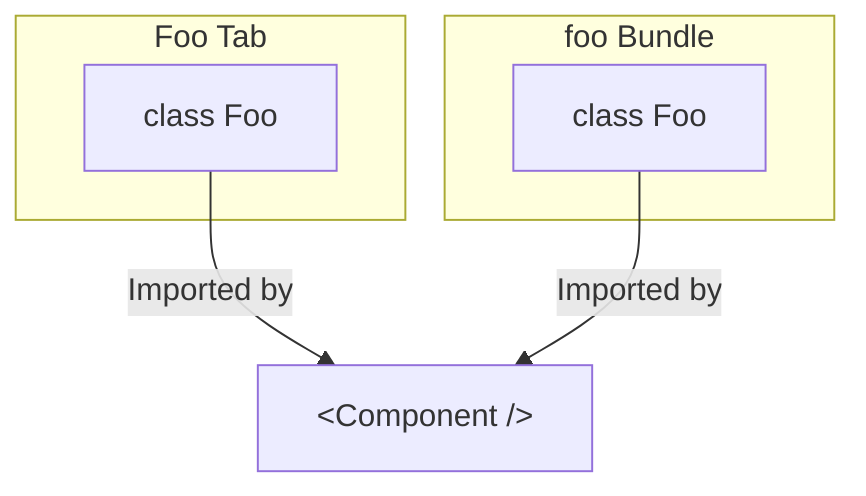

# Miscellanous Information

[[toc]]

## Object/Exports Identity

Consider the following bundle:

> [!INFO] TL;DR
> `js-slang` doesn't guarantee that objects exported by bundles reference the same objects defined in the bundle
> when loaded from Source.

```ts [bundle.ts]
export function foo() { return 0; }

export function bar() { return 1; }
```

Now consider a tab that wants to display something to the user depending on what function
the user passed to the tab:

```tsx [tab.tsx] {8,10}
import { foo, bar } from '@sourceacademy/modules-bundle0';

interface Props {
  func: () => number;
}

export function Tab({ func }: Props) {
  if (func === foo) {
    return <p>Foo was selected!</p>;
  } else if (func === bar) {
    return <p>Bar was selected!</p>;
  } else {
    return <p>Nothing was selected!</p>;
  }
}
```

Notice that the two comparisons (the two highlighted lines) use `===`. In Javascript, functions are compared by reference equality.

Unfortunately, `js-slang` does not guarantee this kind of object identity stability during bundle loading, so these two
comparisons might fail even if the cadet provides the `foo` or `bar` function.

A workaround for this would be to attach a symbol to your object:

```ts
export const fooSymbol = Symbol('foo');
export function foo() { return 0; }
foo[fooSymbol] = true;

export const barSymbol = Symbol('bar');
export function bar() { return 0; }
bar[barSymbol] = true;
```

and then check for the symbol on the object:

```tsx
import { foo, fooSymbol, bar, barSymbol } from '@sourceacademy/modules-bundle0';

interface Props {
  func: () => number;
}

export function Tab({ func }: Props) {
  if (fooSymbol in func) {
    return <p>Foo was selected!</p>;
  } else if (barSymbol in func) {
    return <p>Bar was selected!</p>;
  } else {
    return <p>Nothing was selected!</p>;
  }
}
```

`js-slang` will ensure that all of these properties are preserved.

> [!IMPORTANT]
> Notice that the check is being done on the value passed into the tab via its props and _NOT_ on the
> `foo` and `bar` imports which are imported from the bundle directly.
>
> This identity problem only affects exports when they are loaded via Source and not when they are
> accessed directly from Javascript.

### `instanceof` will not work at runtime

This issue also applies to classes. Consider the following toy example. The bundle below exports a single `Foo` class.

```ts [foo/src/index.ts]
import context from 'js-slang/context';

export function display_foo() {
  context.moduleContexts.foo.state = new Foo();
}

export class Foo {
  public foo(): string {
    return 'foo!';
  }
}
```

We then have a tab, that imports that class directly from the bundle:

```tsx [Foo/index.tsx]
import { Foo } from '@sourceacademy/bundle-foo';
import { defineTab, type ModuleTab } from '@sourceacademy/modules-lib/tabs/utils';

const Component: ModuleTab = ({ context }) => {
  return <p>This is a tab!</p>;
};

export default defineTab({
  icon: 'save',
  label: 'foo',
  toSpawn: context => context.moduleContexts.foo.state instanceof Foo,
  body: context => <Component context={context} />
});
```

By design, if `display_foo` is called, `foo`'s bundle state gets set to an instance of the `Foo` class, which signals to the frontend that it should spawn
the tab (because `toSpawn` will return `true`).

However, at runtime, you may find that the tab never spawns. A little investigation will show that the `instanceof Foo` check always returns `false`. What's going on?

What has happened is an issue similar to the one above. Because the tab imports from the bundle directly, it will keep its own copy of the bundle code, separate from the instance that gets loaded
by `js-slang`:



To fix this, we can reuse the symbol technique:

```ts [foo/src/index.ts]
import context from 'js-slang/context';

export function display_foo() {
  context.moduleContexts.foo.state = new Foo();
}

const fooSymbol = Symbol.for('foo/Foo');

export class Foo {
  public foo(): string {
    return 'foo!';
  }

  private get _symbol() {
    return fooSymbol;
  }

  public static isFoo(obj: unknown): obj is Foo {
    if (typeof obj !== 'object' || obj === null) return false;

    return '_symbol' in obj && obj._symbol === fooSymbol;
  }
}
```

Since `Symbol.for` always returns the same symbol given the same string input, the `isFoo` type check will now work properly:

```tsx [Foo/index.tsx] {11}
import { Foo } from '@sourceacademy/bundle-foo';
import { defineTab, type ModuleTab } from '@sourceacademy/modules-lib/tabs/utils';

const Component: ModuleTab = ({ context }) => {
  return <p>This is a tab!</p>;
};

export default defineTab({
  icon: 'save',
  label: 'foo',
  toSpawn: context => Foo.isFoo(context.moduleContexts.foo.state),
  body: context => <Component context={context} />
});
```

This workaround is necessary for **all** `instanceof` checks in tab code when comparing with classes exported by bundles.

> [!TIP] Within Bundle Code
>
> The above section only applies when data and classes are used across tabs and bundles. Code that works entirely within
> your bundle or entirely within your tab like the one below will continue to work just fine:
>
> ```ts [functions.ts]
> export class Foo {}
>
> if (obj instanceof Foo) {
>   // will work correctly!
> }
> ```

> [!TIP] Type Aliases and Interfaces
>
> Typescript type aliases and interfaces get erased at runtime, so you can't use `instanceof` with them. You
> should already have been using other means of verifying those types at runtime.
