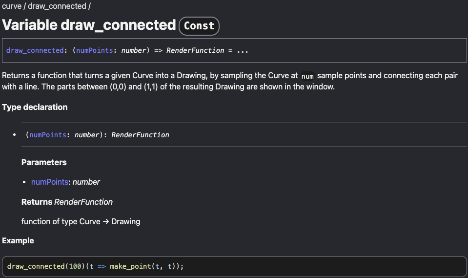
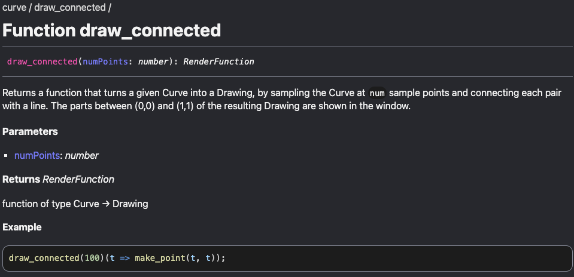
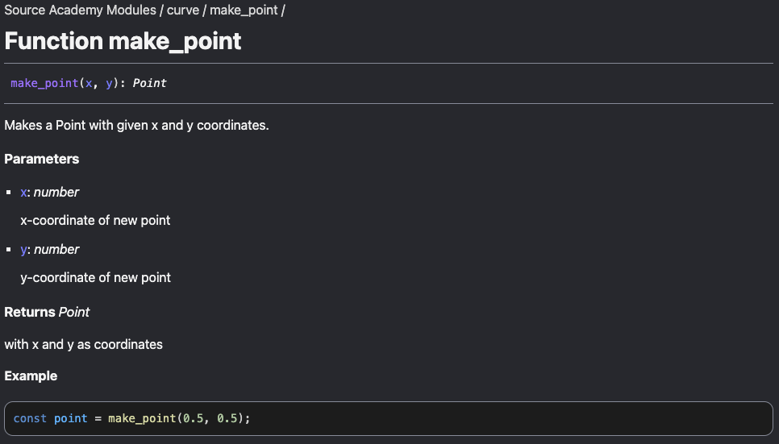

# Bundle Documentation
Documentation for Source bundles is generated using the [`typedoc`](https://typedoc.org) tool. There are two types: HTML and JSON documentation.

By reading comments and type annotations, `typedoc` is able to generate both human readable documentation and documentation in the form of JSON.

> [!WARNING]
> By default, `typedoc` does type checking for code, similar to `tsc`. This functionality has been turned off as more often then not, `tsc` will be run before `typedoc`, making the type checking performed by `typedoc` extraneous.
> 
> This does mean that if the documentation is built without running `tsc`, there is a possibility that type errors will cause `typedoc` to crash.

## Writing Documentation
`typedoc` reads both Typescript type annotations, as well as [TSDOC](https://tsdoc.org) style comments. It will build documentation for all functions and constants exported by the particular module.

Let us look at an example from the `curve` module.
```ts
// functions.ts
/**
 * Makes a Point with given x and y coordinates.
 *
 * @param x x-coordinate of new point
 * @param y y-coordinate of new point
 * @returns with x and y as coordinates
 * @example
 * ```
 * const point = make_point(0.5, 0.5);
 * ```
 */
export function make_point(x: number, y: number): Point {
  return new Point(x, y, 0, [0, 0, 0, 1]);
}
```

```ts
// index.ts
export { make_point } from './functions.ts';
```
Since the `curve` bundle exports the `make_point` function, `typedoc` will generate documentation for it. 

The following sections are conventions for writing documentation.

### Entry Point
At the entry point for each bundle, there should be a block comment that provides general information about the bundle.

This example is taken from the `repeat` bundle:
```ts
// repeat/src/index.ts
/**
 * Test bundle for Source Academy modules repository
 * @author Loh Xian Ze, Bryan
 * @author Tang Xin Kye, Marcus
 * @module repeat
 */

export { repeat, twice, thrice } from './functions';
```
It is important that you provide an `@module` tag in this description. Otherwise, the build tools may not be able to detect your bundle's
documentation properly.

### Use of `@hidden`
If there are exports you want hidden from the output of the documentation, you must use the either `@hidden` tag.

The example below is taken from the `rune` bundle:
```ts
// rune/src/type_map.ts
import createTypeMap from '@sourceacademy/modules-lib/type_map';

const typeMapCreator = createTypeMap();

export const { functionDeclaration, variableDeclaration, classDeclaration } = typeMapCreator;

/** @hidden */
export const type_map = typeMapCreator.type_map;
```

This causes `type_map` to be removed from the documentation, even if it is exported from `rune/src/index.ts`.

> [!WARNING]
> Bundle `type_map`s are supposed to be internal implementation details hidden from users. If you forget to apply a `@hidden` tag to
> your bundle's type map export, the build tools will show a warning.

### Use of `@function`
Following v0.28, Typedoc only documents function-like types as functions if they are explicitly typed as functions (see the issue [here](https://github.com/TypeStrong/typedoc/issues/2881)).
This means that if you have code that looks like this:
```ts
// curve/functions.ts
function createDrawFunction(
  scaleMode: ScaleMode,
  drawMode: DrawMode,
  space: CurveSpace,
  isFullView: boolean
): (numPoints: number) => RenderFunction {
  return (numPoints: number) => {
    // implementation details
  };
}

export const draw_connected = createDrawFunction('none', 'lines', '2D', false);
```
and `RenderFunction` has the following type:
```ts
// curve/types.ts
/**
 * A function that specifies additional rendering information when taking in
 * a CurveFunction and returns a ShapeDrawn based on its specifications.
 */
export type RenderFunction = {
  (func: Curve): CurveDrawn
  is3D: boolean
};
```
Typedoc won't consider `draw_connected` to be a function. Instead it will consider it to be a variable:


This is because `drawConnected` is of type `RenderFunction` and `RenderFunction` is only _function-like_.

To remedy this, include the `@function` tag in your documentation:
```ts {6}
/**
 * Returns a function that turns a given Curve into a Drawing, by sampling the
 * Curve at `num` sample points and connecting each pair with a line.
 * The parts between (0,0) and (1,1) of the resulting Drawing are shown in the window.
 *
 * @function
 * @param num determines the number of points, lower than 65535, to be sampled.
 * Including 0 and 1, there are `num + 1` evenly spaced sample points
 * @return function of type Curve → Drawing
 * @example
 * ```
 * draw_connected(100)(t => make_point(t, t));
 * ```
 */
export const draw_connected = createDrawFunction('none', 'lines', '2D', false);
```

The export will now be correctly recognized as a function:


There is no automatic way to make this distinction, so it is up to the bundle authors to make sure that this convention is adhered to.

## HTML Documentation
The human readable documentation resides in the `build/documentation` folder. You can view its output [here](https://source-academy.github.io/modules/documentation). This is what the output for `make_point` looks like:



The description block supports formatting using Markdown. The markdown is translated into HTML during building.

## JSON Documentation

To provide the frontend with documentation that can be directly displayed to the user, each module has its own json file in the `jsons` folder containing the formatted descriptions of exported variables.
Using the example code above, here is what the JSON documentation looks like for the actual `curve` bundle:
```jsonc
{
  "make_point": {
    "kind": "function",
    "name": "make_point",
    "description": "<p>Makes a Point with given x and y coordinates.</p>",
    "params": [
      [
        "x",
        "number"
      ],
      [
        "y",
        "number"
      ]
    ],
    "retType": "Point"
  },
  // ...other functions and constants
}
```
This is then displayed by the frontend:


When building the json documentation for a bundle, the following steps are taken:
1. From `typedoc`'s output, extract the [project](https://typedoc.org/api/classes/ProjectReflection.html) corresponding to the bundle.
1. For each exported variable, run it through a converter to convert the `typedoc` project into a single string:
    - For constants, their names and types are extracted
    - For functions, their name, the names and types of each parameter, and return types are extracted.\
    The descriptions of both functions are constants are also included, but first they are passed through a Markdown to HTML converter called [drawdown](https://github.com/adamvleggett/drawdown), included in this project as `drawdown.ts`
3. The code then converts it to the HTML format expected by the frontend
3. All the processed strings then get written to a json file in the jsons folder.

If no documentation could be found, or there was an error parsing the documented code, the system will still output jsons, just with warnings.
