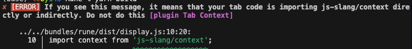

# Working with Module Contexts
As mentioned, module contexts are a way to pass information between bundles and tabs. A module's tabs are always loaded after its bundle, and only if its bundle was imported by the Source program.
This means that it is safe to assume that a module's context object has been initialized (if there is code in the bundle that does so)

## Build Error: `'Do not import js-slang/context directly or indirectly in tab code'`
Sometimes, it makes sense to import functions from a bundle to use with a tab.
```ts
// Repeat/index.tsx
import { foo } from '@sourceacademy/bundle-repeat';

export default {
  body: () => {
    foo(); // From bundle!
    // implementation...
  },
}
```
However, when you build this code, the build system throws an error that looks like this:


This is likely because you are importing something from the bundle that uses the context object. For example, consider the repeat bundle:
::: code-group
```ts [index.ts]
import context from 'js-slang/context';

export const bar = () => console.log(context);
export { foo } from './functions';

```
```ts [functions.ts]
export const foo () => 'do nothing';
```
:::

If you import from `repeat/index.ts` either by specifying `import { foo } from '../../bundles/repeat';` or `import { foo } from '../../bundles/repeat/index'`, because `repeat/index.ts` imports the context object.
To get around this, you can import the function directly from a file whose dependencies do not include the context import:

```ts
// import straight from functions.ts, which does not rely on the context
import { foo } from '@sourceacademy/bundle-repeat/functions';

export default {
  body: () => {
    foo(); // From bundle!
    // implementation...
  },
}
```
This way, when the tab is transpiled, the context import is never triggered.

> [!WARNING]
> Functions that need the context should not be imported by tabs. If you need that functionality you probably should be using the module context directly from the `body()` function.
