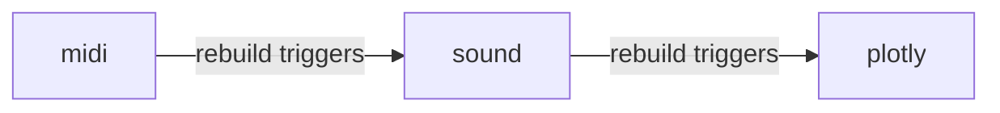
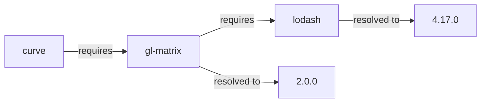
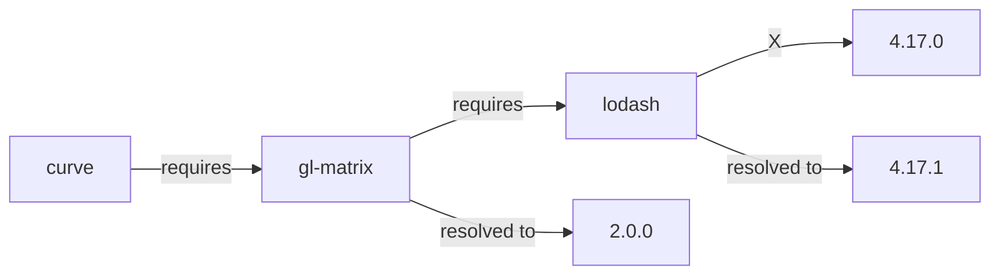

# Determining When to Rebuild a Package

For this section, it is important to understand the distinction between workspace packages and Yarn packages:

<table>
  <thead>
    <tr>
      <th></th>
      <th>Workspace</th>
      <th>Yarn</th>
    </tr>
  </thead>
  <tbody>
    <tr>
      <td>Source</td>
      <td>Contained entirely within this repository</td>
      <td>Published to and installed from a remote repository like npm. </td>
    </tr>
    <tr>
      <td>Version range looks like</td>
      <td><code>workspace:^</code></td>
      <td><code>^1.8.1</code></td>
    </tr>
  </tbody>
</table>

Specificailly, we are concerned with detecting when to rebuild a workspace package.

There are many workspace packages contained within this repository. It would be entirely unnecessary to rerun building and
testing for every single workspace package if changes were only made to one. It thus makes sense to implement some kind of
dependency tracking system to rebuild workspace packages only if they were affected by a change.

Importantly, for the CI/CD pipeline, we are concerned only with changes relative to the **master** branch.

For each workspace package, there are two main kinds of changes we must detect:
1. Non-transitive
2. Transitive

## Non-Transitive Changes

A non-transitive change is the simplest to determine: we can do this by checking if the directory containing the
workspace package contains any diffs relative to the master branch. This can be done using the following git command:

```sh
git --no-pager diff --quiet  origin/master -- directory
```

This git command exits with a non-zero exit code if it detected changes and zero if it did not. Programatically,
this is done by using the `@actions/exec` library's `getExecOutput` function:

```js
const { exitCode } = await getExecOutput(
  'git',
  ['--no-pager', 'diff', '--quiet', 'origin/master', '--', directory],
  {
    failOnStdErr: false,
    ignoreReturnCode: true
  }
);
return exitCode !== 0;
```

## Transitive Changes

Transitive changes occur when one of the current workspace package's dependencies contain changes. For example, the `sound` bundle
relies on the `midi` bundle, so if the `midi` bundle has changes (and thus needs to be rebuilt), the `sound` bundle would
also need to be rebuilt, even if the `sound` bundle did not contain any changes. 
Since the `plotly` bundle relies on the `sound` bundle, it too would also need to be rebuilt.



However, a workspace package is often dependent on more than just other workspace packages. In fact, most workspace packages
also rely on some Yarn packages, which in turn are also dependent on other Yarn packages. Normally, this dependency resolution process
is handled automatically by Yarn.

When a change is made to a workspace package's dependencies (e.g. upgrading from `v1.0` to `v2.0` of `gl-matrix` to take advantage
of new features), that workspace package's `package.json` must reflect this change. Then, the [above](#non-transitive-changes) method
will be able to detect that that workspace package needs to be rebuilt. However, a workspace package's dependencies can change even
if there were no changes to its `package.json`.

This can occur because of [semantic versioning](https://semver.org). Often, the version range specified in a `package.json` doesn't
specify a specific version to be used. For example, the `package.json` below actually specifies that the `curve` bundle is
compatible with anything that is a minor revision to version 2 of `gl-matrix`:

```jsonc
{
  "name": "@sourceacademy/bundle-curve",
  "dependencies": {
    "gl-matrix": "^2.0.0"
  }
}
```

This is good, because it provides us some flexibility: we're able to use newer versions of the same package that are mostly compatible but
might come with things like bug fixes.

Now suppose that `gl-matrix` itself relies on another Yarn package like `lodash`:

```jsonc
{
  "name": "gl-matrix",
  "dependencies": {
    "lodash": "^4.17.0"
  }
}
```

Because we can only use 1 version of a package at any time, Yarn has to pick from the list of allowed available versions. In this case the
version range allows for `4.17.0` or `4.17.1` or several other possible versions of `lodash`. This process is called "resolution".

Once Yarn finishes resolving all of these version ranges, it stores these resolutions in the lockfile. This allows us to use the same
resolutions and thus the same versions of packages across multiple machines.

Suppose that Yarn determines that the version of `lodash` it wants to use for `gl-matrix` is `4.17.0`. This is installed
and the lockfile reflects that `lodash@^4.17.0` got resolved to `lodash@4.17.0` (note the absence of `^`).



Now, suppose that the publishers of `lodash` find a minor bug in one of their functions and release a small patch to rectify it. They
publish this new version as version `4.17.1`. Notice that this version is still compatible with the `^4.17.0` specification.

When the repository's automated depedency upgrading bot (Renovate Bot) detects this, it will attempt to cause Yarn to install version `4.17.1`
instead of `4.17.0` for `lodash`. It does this by updating the lockfile. But now we have a problem: the `curve` bundle transitively relies
on `lodash` through `gl-matrix`. 



The `curve` bundle's dependency tree has changed, so we need to rebuiid and test it (to make sure that it works with this new version of `lodash`).

Yet, because there were no changes made to its `package.json` or to the code of the `curve` bundle, the `git diff` method won't be able
to detect that we need to rebuild the `curve` bundle.

There is, however, one file that definitely changed: the lockfile. Thus, by parsing the difference between the lockfile on the master branch
and the local lockfile, we can determine which package resolutions changed.

Then, using the `yarn why` command, we can determine which package is reliant on those specific resolutions. We can do this recursively
until we reach one of our workspace packages, at which point we know that that particular workspace needs to be rebuilt.

Let us work through the above example:
1. Using `git diff`, we determine that the lockfile has changed relative to the master branch.
2. We compare the local lockfile with the master lockfile and determine that that `lodash@4.17.0` is present in the master lockfile,
while `lodash@4.17.1` is not. So now we know that we need to determine why `lodash@4.17.1` has been included.
3. We run `yarn why lodash` (without the version since the `why` command doesn't accept it) to obtain the list of packages that are
dependent on `lodash`.
4. For each package dependent on `lodash`, we check that that particular package actually depends on `lodash@4.17.1`, since they might
be dependent on other versions of `lodash`. In this case, we see that `gl-matrix@2.0.0` needs `lodash@4.17.1`.
5. We do this recursively until we reach our workspace package, and thus determine that it needs to be rebuilt. In this case, we see
that the `curve` bundle requires `gl-matrix@2.0.0` and thus relies on `lodash@4.17.1`, so it needs to be rebuilt.

## Building the Dependency Tree

Once we determine which workspace packages contain either transitive or non-transitive changes, we must then go through the rest of the
workspace packages to determine which other ones need to be rebuilt. From the example above, if the `midi` bundle needs to be rebuilt
because there were changes made to its code, we need to be able to determine that the `sound` bundle also needs to be rebuilt. And since
the `sound` bundle needs to be rebuilt, then the `plotly` bundle also needs to be rebuilt.

This is done by building a simple dependency graph and then creating a topological ordering. Starting with the workspace packages that aren't
dependent on any other workspace packages and working our way to the end of the topological sort, we are able to determine exactly which
workspace packages need to be rebuilt.

::: details Circular Dependency Graph

A topological sort of course requires that our dependency graph doesn't contain a cycle. Yarn won't actually let you create a dependency
graph that is cyclic via workspace dependencies, so we're good to always assume that such a topological sort is possible.

:::
